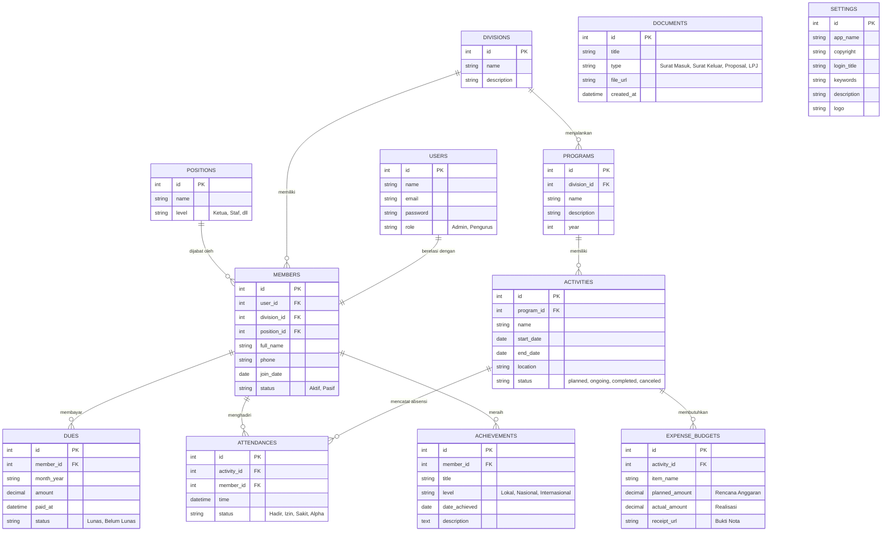

# Product Requirements Document (PRD)
## Sistem Manajemen Organisasi

### 1. Ringkasan Eksekutif (Executive Summary)
Sistem Manajemen Organisasi adalah platform digital terpadu yang dirancang untuk mengelola seluruh aspek operasional organisasi secara efisien. Sistem ini menyediakan solusi sentralisasi data untuk pengelolaan keanggotaan, struktur hierarki, program kerja, keuangan (iuran dan anggaran), pengarsipan dokumen, hingga pencatatan prestasi.

### 2. Tujuan dan Sasaran
- **Penyimpanan Terpusat:** Mengelola seluruh data anggota, kegiatan, arsip, dan keuangan dalam satu platform (Single Source of Truth).
- **Efisiensi Kinerja:** Memudahkan setiap divisi dalam merencanakan program kerja, mengelola anggaran, dan melacak tingkat partisipasi (absensi) anggota.
- **Transparansi Keuangan:** Memantau pemasukan dari iuran anggota serta pengeluaran untuk realisasi kegiatan secara jelas dan terukur.
- **Digitalisasi Dokumen:** Mengurangi penggunaan kertas melalui pengarsipan digital untuk dokumen dan surat menyurat organisasi.

### 3. Tujuh (7) Fitur Utama
1. **Data Anggota dan Struktur Organisasi:** Pengelolaan biodata lengkap anggota beserta pemetaan struktur organisasi berdasarkan divisi dan jabatan.
2. **Program Kerja per Divisi:** Perencanaan, penyusunan, dan pemantauan program kerja yang menjadi tanggung jawab masing-masing divisi.
3. **Kegiatan dan Absensi Anggota:** Penjadwalan kegiatan organisasi yang terhubung langsung dengan sistem absensi/kehadiran anggota untuk mengukur partisipasi.
4. **Kas dan Iuran Anggota:** Pencatatan kewajiban dan pembayaran iuran bulanan/kas dari anggota.
5. **Anggaran dan Realisasi Kegiatan:** Manajemen pengajuan anggaran (budgeting) untuk setiap kegiatan beserta pencatatan pengeluaran aktual (realisasi).
6. **Arsip Dokumen Organisasi:** Repositori penyimpanan dokumen resmi, surat masuk/keluar, notulensi, dan proposal/LPJ.
7. **Prestasi dan Penghargaan:** Pencatatan portofolio prestasi atau penghargaan yang diraih oleh anggota maupun organisasi secara keseluruhan.

### 4. Arsitektur & Skema Data (Data Schema)

#### 4.1 Daftar Tabel Database
1. **`users`**: Tabel otentikasi (login, kredensial, dan hak akses/role sistem).
2. **`members`**: Profil detail anggota (NIM/NIK, nama, kontak, dll), berelasi langsung dengan akun `users`.
3. **`divisions`**: Daftar divisi atau bidang dalam organisasi (misal: Humas, R&D, dll).
4. **`positions`**: Daftar jabatan (misal: Ketua, Sekretaris, Koordinator, Staf).
5. **`programs`**: Daftar program kerja yang dirancang, di mana setiap program dimiliki oleh sebuah divisi.
6. **`activities`**: Kegiatan-kegiatan turunan dari sebuah program kerja, lengkap dengan jadwal pelaksanaannya.
7. **`attendances`**: Data presensi anggota untuk setiap kegiatan yang diselenggarakan.
8. **`dues`**: Catatan pembayaran iuran kas oleh anggota organisasi.
9. **`expense_budgets`**: Rincian rencana anggaran biaya (RAB) dan realisasi pengeluaran untuk suatu kegiatan.
10. **`documents`**: Penyimpanan arsip dokumen (proposal, surat, LPJ, dll).
11. **`achievements`**: Rekam jejak prestasi yang diperoleh anggota.
12. **`settings`**: Konfigurasi global sistem organisasi (logo, nama, dll).

#### 4.2 Penjelasan Relasi (Naratif)
- Setiap **User** terhubung (One-to-One) ke satu **Member**.
- Seorang **Member** menempati sebuah posisi (**Position**) dan ditugaskan di sebuah divisi (**Division**).
- Setiap **Division** menaungi banyak **Programs** (One-to-Many).
- Sebuah **Program** dapat terdiri dari banyak **Activities** (One-to-Many).
- Setiap **Activity** memiliki catatan kehadiran (**Attendances**) yang mereferensikan **Member** yang hadir (Many-to-Many via tabel Attendance).
- Setiap **Activity** memiliki rincian **Expense Budgets** untuk memantau dana yang diajukan dan dikeluarkan.
- Setiap **Member** memiliki riwayat pembayaran **Dues** (iuran kas) dan riwayat pencapaian **Achievements**.
- Tabel **Documents** dapat bersifat umum (milik organisasi) atau direferensikan ke tabel spesifik (misal: LPJ terkait dengan Activity).

#### 4.3 Visualisasi ERD (Mermaid)

